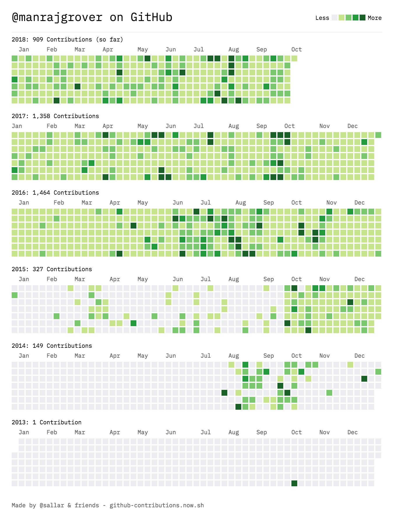

The day is here. I've finally decided to end something I started **3 years back**. **1097 days** of continuous learning, developing, collaborating and growing. Something I will remember for the rest of my life. I got to author some good personal projects and work with and contribute to organizations like [DuckDuckGo](http://duckduckhack.com/u/manrajgrover/), [OpenMF](http://mifos.org/), [Mozilla](https://www.mozilla.org/en-US/), and yes, [TensorFlow](https://js.tensorflow.org). And it did take a good amount of dedication and sacrifices I can tell you. In this post, I'll share the motivation behind this, challenges faced during this journey, the reason for ending it and everything in between. I'll cover my learnings in a separate post which will also double up as my guide to open source.

    <i>Generated using https://github-contributions.now.sh/ by <a href="https://github.com/sallar" target="_blank">sallar</a></i>

## Wait, what? When did it even began?

It was fall of 2015 and my final year of college had just begun. I already had an offer in a company (you know, one less thing to worry about) and had some time at my hand which I wanted to utilize well. I had few projects that I had started way back but never found time to complete and release them. Also, I was not happy with the quality of the code I used to write. I didn't have anyone back then looking at my code and telling me how I can improve myself. Finally, I wanted to understand technologies in depth and build things using them.

So I decided to complete what I had started and also learn something new every day. I needed some way to track progress and Github served to be the right platform. I started working on the projects, trying to make time for it every day but just as I thought, the initial spree didn't last long and it broke in 2 weeks. I didn't give up and planned to restart it. This time, with better management in mind.

Initially, I worked on random projects that I had started for learning new things and soon moved towards building concrete things. Those were still the projects that no one would use but they did something and I learned things building them. These projects helped set up a good base for things I wanted to build in the future. I took those learnings and applied them while reviving the abandoned projects. I made them work using the best practices I knew.

Soon, I stopped keeping track of it. It became a habit to think about what I would do today and the resources I would need to refer. I would plan my day well in advance and prioritize things accordingly. I learned the skill of time hacking and I still reap the benefits of it.
I never publicized or told anyone about what I was doing and why for a couple of reasons. I didn't want any publicity with this regard. And secondly, it was a personal experiment which may or may not help anyone. And I still didn't have enough positive results to recommend someone something like this.

I did, however, have some people laugh and mock me who saw my Github profile. But I didn't care much. For what I knew, I had nothing to lose and everything to gain. The only investment was time which I didn't want to spend watching a famous series. I like how [Ken Wheeler](https://twitter.com/ken_wheeler) puts it and I [quote](https://medium.com/codezillas/a-bitter-guide-to-open-source-a8e3b6a3c1c4) him:

> **Fuck those people.**

I realized putting a constraint is a powerful concept when I decided to code a project exploring what one can do with a single `
` element. Through this, [SingleDivProject](https://github.com/manrajgrover/SingleDivProject) was born. Having a constraint enabled me to learn CSS properties I didn't know existed just to achieve a design I wanted. It was well received and motivated me to code more of successful projects.

I started contributing to projects and organizations like DuckDuckGo with great maintainers just to get feedback on my code quality. Do you see how advantageous this is for everyone? I add a feature to their codebase reducing maintainer's overhead. My code gets reviewed and I get to improve my coding skills. The pull request gets merged and the project users are happy with the new feature. Win-win?

Weeks turned into months. Months turned into years. I grew as a developer and so did my ambitions. I started writing packages and command-line tools. I would make sure I do something I haven't done before. If I learned something new, I would code and incorporate them into my projects.

I aligned my new-found interests with Open Source projects and started contributing to deeplearn.js, which later became [TensorFlow.js](https://js.tensorflow.org). I learned a lot about inner workings of a machine learning library, various algorithms and how they can be implemented efficiently. I'll surely have a separate post where I'll share my experience contributing to the project.

## Why I'm ending it

Yes, why should I end it if everything is going so well? There are a couple of reasons for it:

**1. Learnings**

I've really learned a lot of things in the past 3 years, from both technical and non-technical perspective. I'm now confident enough to manage my time, pick up new technologies, best practices, work on large codebases, deploy things and a whole lot more. But now, I wish to learn things that can only be achieved if I move away from this constraint of contributing every day. Things that will take more than a day before they can be committed and months to complete.

**2. Changing goals**

I've achieved the goals I had set for myself with regard to the contribution spree. I've checked every single box of the list of goals I had and it's time to focus on other goals. My interests are inclining more towards research, specifically machine learning and would like to focus on and give full attention to it. Who knows I might start an open source machine learning project? Who knows I might do something like this on [Kaggle](https://www.kaggle.com/manrajsingh)? 😉

## So, yeah!

I'm ending my contribution spree today i.e. October 12, 2018. It has been an unforgettable experience and I don't think I will be able to replicate it again. I will still keep contributing to Open Source, keep working on my projects, keep contributing to various organizations, just without worrying about this constraint. I hope it works out well. I love how [Jed Watson](https://medium.com/@jedwatson) puts [it](https://medium.freecodecamp.org/github-broke-my-1-000-day-streak-6ec0c4c3a7d9):

> It's been a personal journey played out in a public space, and so this seems like a fitting way to wrap it up.

So, would I now recommend someone to follow in my footsteps? No, definitely not. However, I would recommend smaller sprints of a couple of weeks and a break after that. Put a time frame on something you wish to achieve and have a strict deadline. And don't forget to reward yourself with your favorite dessert after every achievement.

And like always, I encourage more people to contribute to Open Source. Believe me, you will definitely learn a lot! I recommend reading [Ken](https://twitter.com/ken_wheeler)'s [guide](https://medium.com/codezillas/a-bitter-guide-to-open-source-a8e3b6a3c1c4) to Open Source. I can relate to a lot of things shared in the blog.

Let me know if I can be of any help. I'm [@manrajsgrover](https://twitter.com/manrajsgrover) on Twitter and [@manrajgrover](https://github.com/manrajgrover) on Github.

Till next time. ✌️